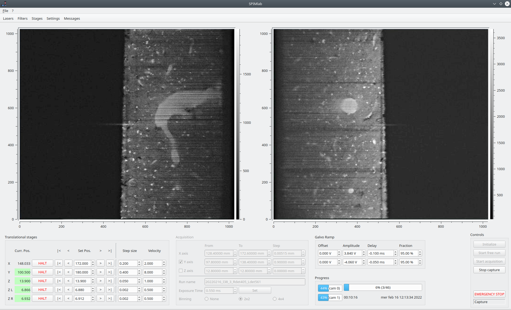

# SPIMlab

SPIMlab is a data acquisition and control software originally developed to control a new dual-view
inverted Ligh Sheet Microscope designed and built by LENS and CNR-INO. It makes use of the
[QtLab](https://github.com/lens-biophotonics/QtLab) library for custom widgets and to communicate
with the hardware.

